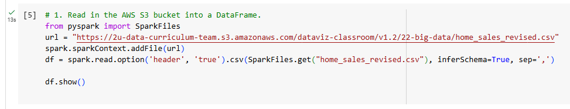
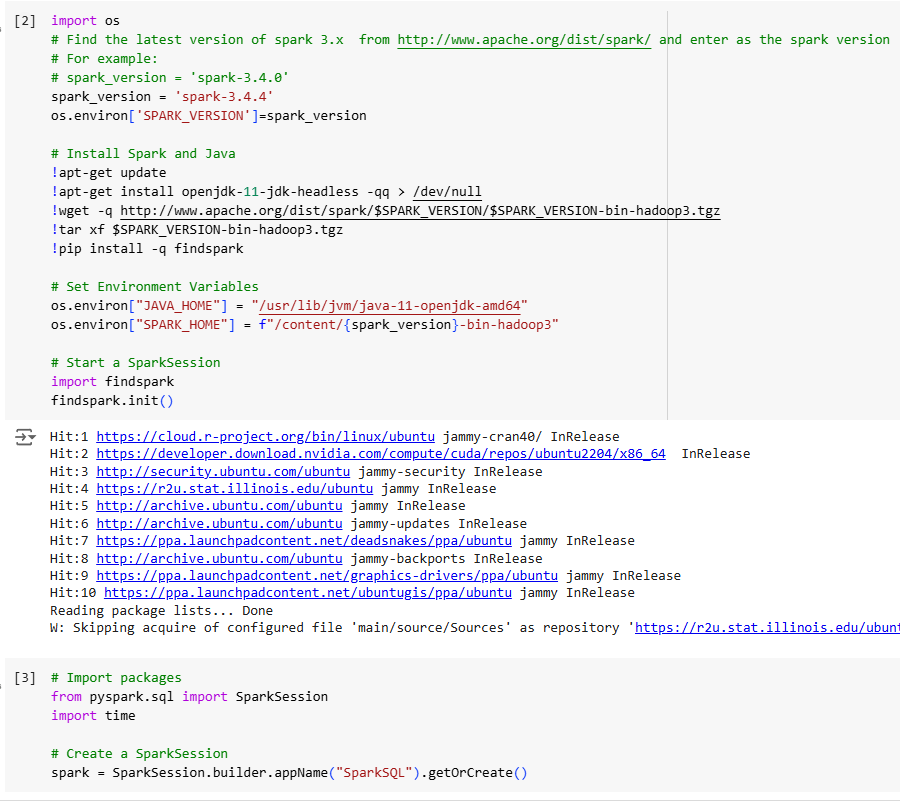
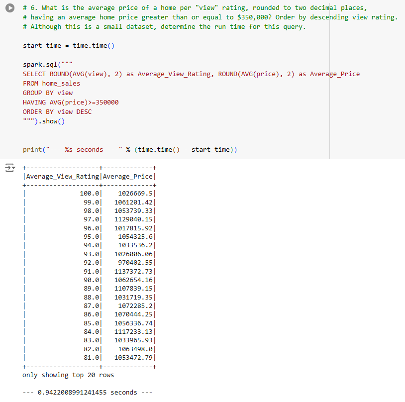
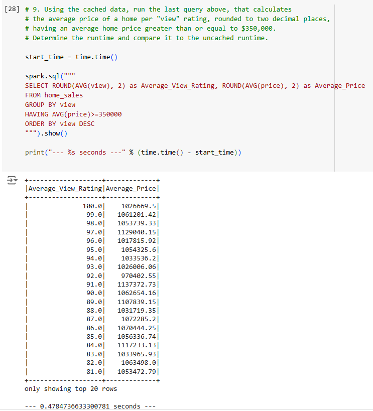
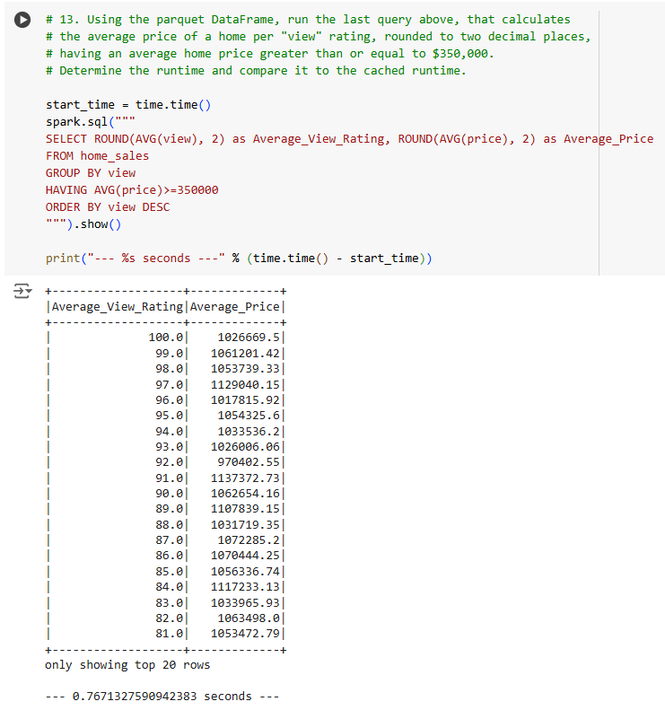
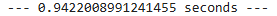
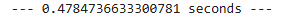
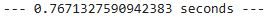
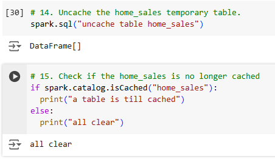
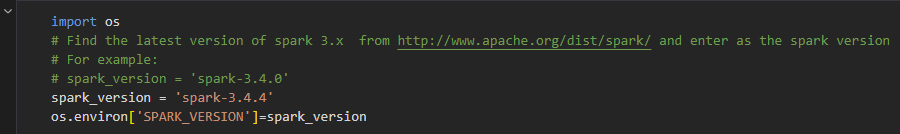

# README for Module 22 Challenge (Home_Sales)

## Introduction

This challenge uses SparkSQL to query sales data and then compares speeds of various approaches. We'll test the relative speeds SparkSQL queries, cached queries, and partitioned quieries. The challenge tries to show the advantages of caching or partitioning data, especially when working with Big Data. This is a Big Data challenge; finding ways to efficiently allocate resources when handling large datasets.

## Data

The input data for this challenge consists of a CSV file from an `s3` bucket. This CSV file contains home sales data. 

Note on `Home_Sales_colab.ipynb`: this file contains the Google Colab notebook that was used for this challenge. It may have difficulty running in VSCode and should likely be tested in Google Colab (see Usage).

## Methodology

This challenge used Google Colab to before these queries. First the dependencies import and installed in the Colab notebook:

Next the data is loaded from the `s3` bucket (see Data), and a temporary view is created. Using this view some preliminary SparkSQL queries as done to inspect data integrity. Once those queries are completed the next ones will be timed to see how long they take. The first timed query did not use any caching or partitioning of the home_sales view:

This query took 0.94 seconds to complete. It will be compared to the next query which cached the home_sales table:

This cached query took 0.47 seconds, about half the time as the first for the same query. There's a clear speed increase here with the table being cached, as it took half the time. Next, we try partitioning home_sales based on the `date_built` column and creating a new view based on this partion:

With this new partitioned view `p_home_sales_p` a test of the same query as the other two is made:

This partitioned query took 0.76 seconds, that's about right in the middle. It's better than the pure SparkSQL query time, but slower than the cached query.

## Results

The speeds of the timed queries:

* SparkSQL: 
* Cached: 
* Partitioned (by `date_built`):

The fastest time was cached, second best was partition, and finally pure SparkSQL queries were last.

Finally the change is closed:

## Conclusion

The results show that being precise about querying data can save resources and increase efficiency. Caching the data in memory can be very helpful, however with very large datasets the entire thing might not fit into memory. Partitioning the data based on what you are trying to query can greatly help efficiency. In this challenge the table was partitioned by `date_built` which was not directly referenced in the query. However, the partitioning still increased the speed of the query. Some tuning could be done to see which column to partition by for the fastest queries. Additionally, tables could potentially be partitioned and then cached for even greater efficiency.

## References

Class materials were used extensively for this assignment, as well as:

* stackoverflow.com
* Xpert Learning Assistant
* ChatGPT.com

## Usage

`Home_Sales_colab.ipnyb` was created in Google Colab and worked best in that environment. This file could be used in VSCode as well but may require some adjustments to do so.

In this confusing bit of code several versions of `spark` are mentioned:

Spark version 3.4.4 was used as it was discovered perform better than other versions.
